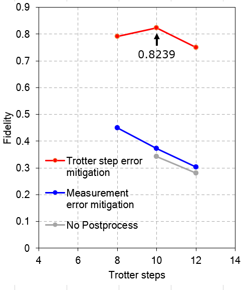

[](https://pycqa.github.io/isort/)
[](https://github.com/psf/black)

# IBMQ open-science-prize-21 challenge
* My solution code for "IBM Quantum Awards: Open Science Prize 2021"
* blog post by IBM: https://research.ibm.com/blog/quantum-open-science-prize

           Simulating physical systems on quantum computers is a promising application of near-term quantum processors.
           This year’s problem asks participants to simulate a Heisenberg model Hamiltonian for a three-particle system on
           IBM Quantum’s 7-qubit Jakarta system. The goal is to simulate the evolution of a known quantum state with 
           the best fidelity as possible using Trotterization.

# Overview 
* Developing a strong machine learning model for error mitigation based on two gates SU(4) parameter space.
    - **This method gave ~0.4 fidelity improvement and fidelity reached 0.8239 at trotter steps=10.**
* Trotter step decomposition is the same as the baseline, which is the host provided notebook method.
* Using KAK decomposition for each step and use 3 CNOT instead of 6 CNOT at the baseline

| | |
| --- | --- |
| |  |

| Phase |  Item |enhancement from baseline|  description |
| --- | --- | --- |--- |
| Hamiltonian Decomposition | Trotter Decomposition | - | Use baseline method, Dividing Hamiltonian into 1-3, 3-5 interaction terms |
| Hamiltonian Decomposition  | KAK Decomposition | +0.20 | 3 cnot gates instead of the 6 CNOT at baseline |
| Post Process | Measurement Error Mitigation |+0.07| Using qiskit class CompleteMeasFilter |
| Post Process | Trotter step Error Mitigation | +0.4| Using ["XGBoost"(eXtreme Gradient Boosting)](https://github.com/dmlc/xgboost) regressor  |

You can check more detail of my solution at `./submission.ipynb`.

## guide for this repository
```txt
    │
    ├ README.md                        # This file
    ├ submission.ipynb                 # My submission notebook for this contest, with brief formulation.
    ├ run_circuit.py                   # top level python code for this contest
    ├ run_error_mitigation_learning.py # error mitigation learning code
    └ src/                             # source code directory of this contest including config/parameters.
```


# How to run
#### **Note**: This code cannot be run properly for now. Because the target quantum device, "Jakarta" for this challenge might not be accessed after this challenge, it seemed to be only available during this challenge.

## 1.Environment settings and JupyterLab launching
* Moving the current directory of your terminal to the directory where this README.md exists. You can also find "Dockerfile" at the same place.
* Running the following shell commands.

* After these commands, you can see the address at your terminal, then open it with your browser for laughing jupyterlab.
    - Something like "http://127.0.0.1:8888/lab?token=xxxxx...xxx" address would be displayed at your bottom of your terminal.

```bash
IMAGE_NAME="ibm_q/open_sci_2022"
TAG="v0.0.1"

# docker image build. it takes few minutes.
docker build -f Dockerfile . -t ${IMAGE_NAME}:${TAG}

# Start a docker container
# The username "jovyan" is a default user at official Jupyter Docker image. So follow that settings here.
docker run -it --rm \
    -p 8888:8888 \
    --user "$(id -u)" --group-add users \
    -v "${PWD}":/home/jovyan/work \
    -w /home/jovyan/work \
    ${IMAGE_NAME}:${TAG}
```

## 2.Starting "submission.ipynb"
* Next, please launch "submission.ipynb" from jupyter lab file browser. That is my solution ipynb.
* You can enter IBMQ API token after laughing "submission.ipynb". There is a section for setting the account on that ipynb.

* If you have already cached IBMQ API token in your local host, you can mount it on a container like below.
```bash
# Staring a container with your cached IBMQ API token setting directory
docker run -it --rm \
    -p 8888:8888 \
    --user "$(id -u)" --group-add users \
    -v "${PWD}":/home/jovyan/work \
    -v "${HOME}"/.qiskit:/home/jovyan/.qiskit \
    -w /home/jovyan/work \
    ${IMAGE_NAME}:${TAG}
```

## Alterative environment
* Using [Anaconda](https://www.anaconda.com/) on a local host
* **Not recommended**, I could check it on my PC, Linux/ubuntu18

### Install
```bash
conda env create -f ./conda_env.yaml
conda activate ibm_q_sub
```
### Starting "submission.ipynb"
```bash
# hit the command below on your terminal
jupyter-lab
# Automatically a session is launched or please open the displayed address with your browser,
# Starting "submission.ipynb" from jupyter lab file browser.
```
